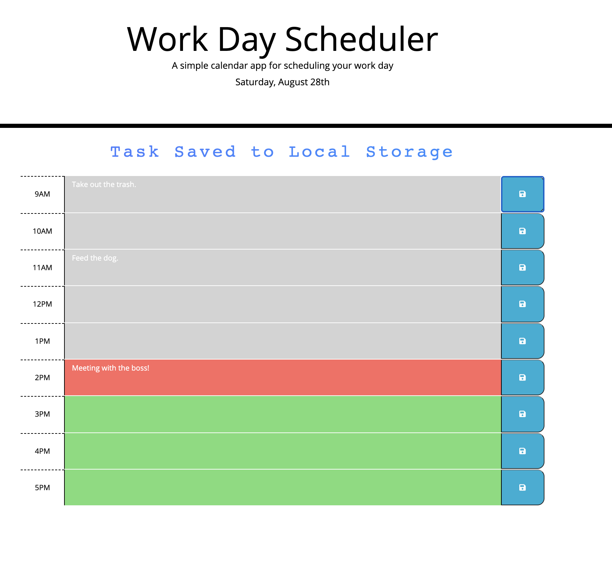

# Work Day Scheduler

The goal of this project was take the provided Starter Code  (HTML and CSS) and implement Third-Party APIs into the application.  

Here's a link to the application: [link](https://carpetonberry.github.io/3rd-Party-API_Work_Day_Scheduler/)

Here's a link to the github repository: [link](https://github.com/CarpeTonberry/3rd-Party-API_Work_Day_Scheduler)

## Layout of Application 

## Structure of JS

The scheduler covers the business hours of 9-5. The day is automatically updated. When the day changes, the text box will update it's color based on the time:
    
    Red = the present hour
    Green = the future 
    Grey = the past

When a task is saved, a confrimation text will appear for 5 seconds and then disappear.

## Future Development 

The next steps for this applications is to have it record events happening on a monthly scale. This will allow for the app to be used in a more strategic manner vs being a daily organizer.

## Tl;DR

*Coding everything from scratch, using third party libraries is a very effective way to build powerful code without having to make everything from scratch.  

*Don't forget to import your JS scripts in the HTML! 